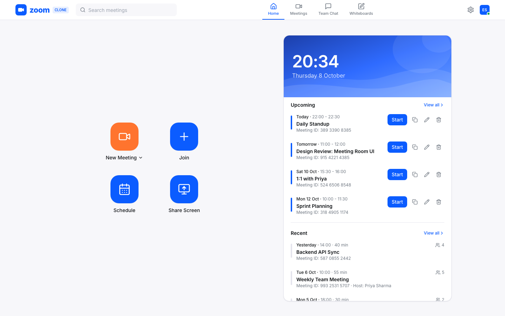
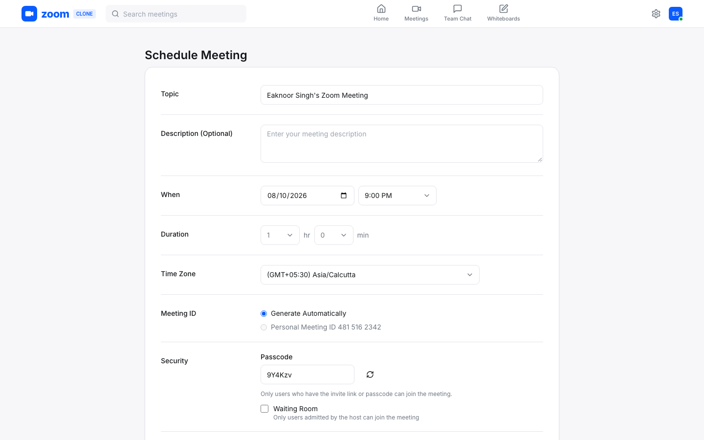
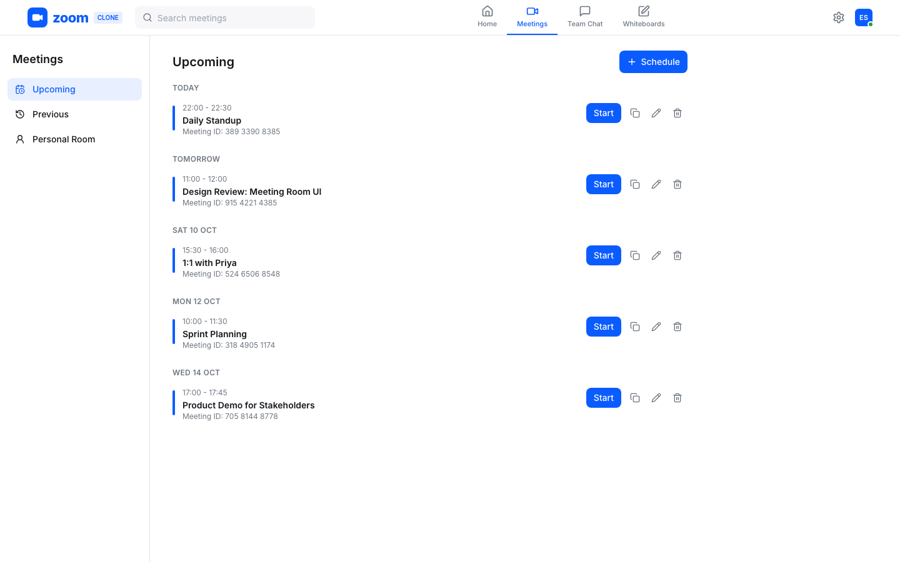
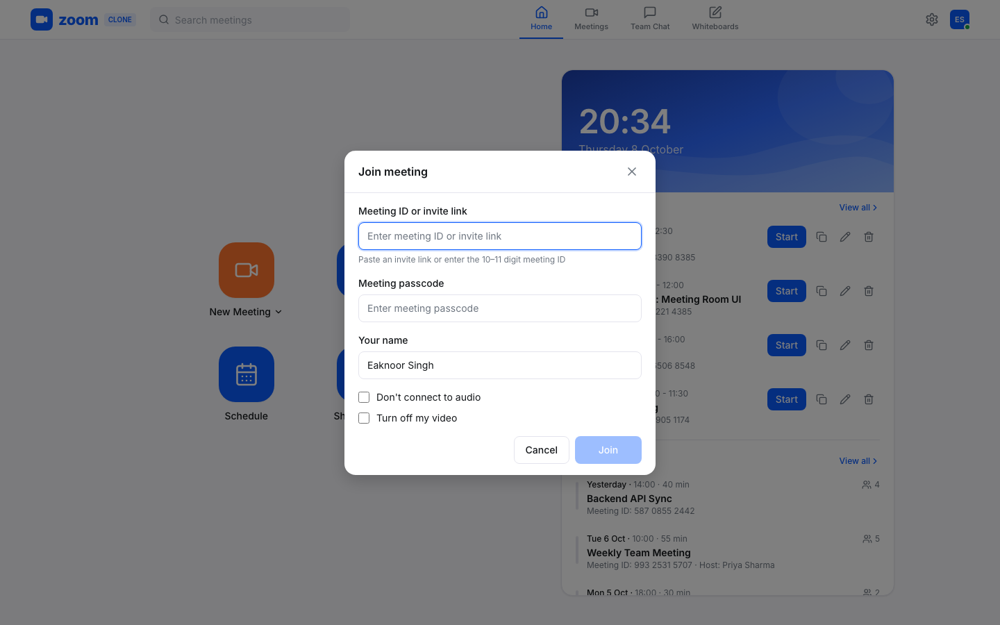
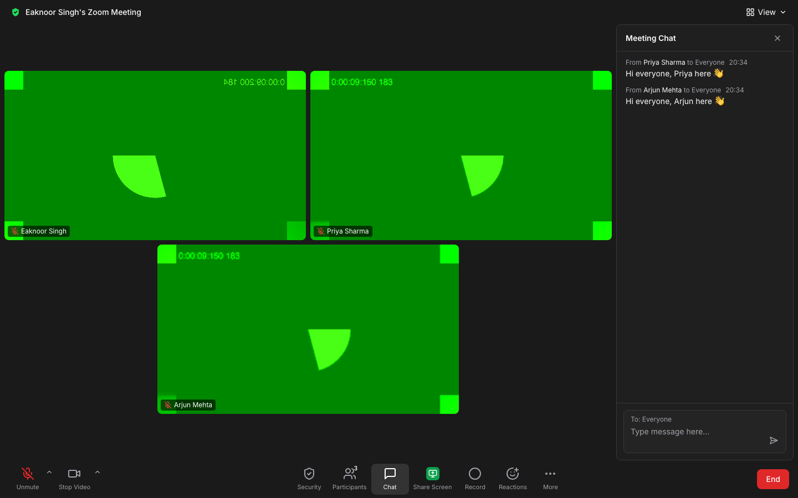
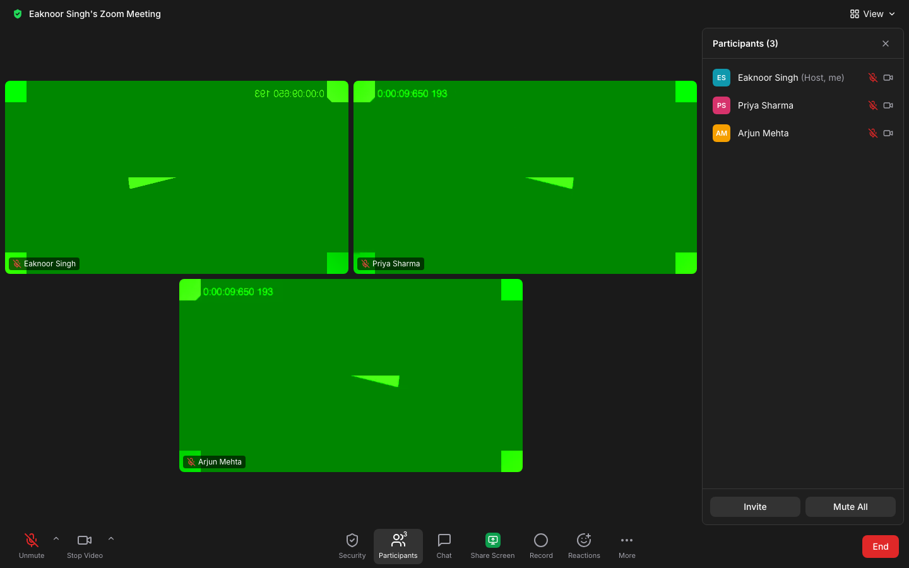
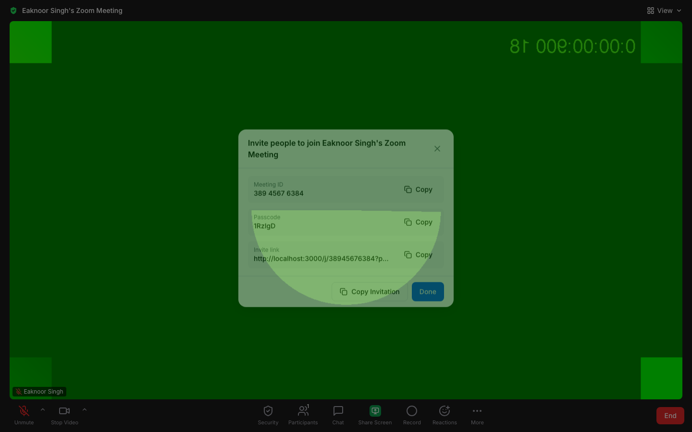
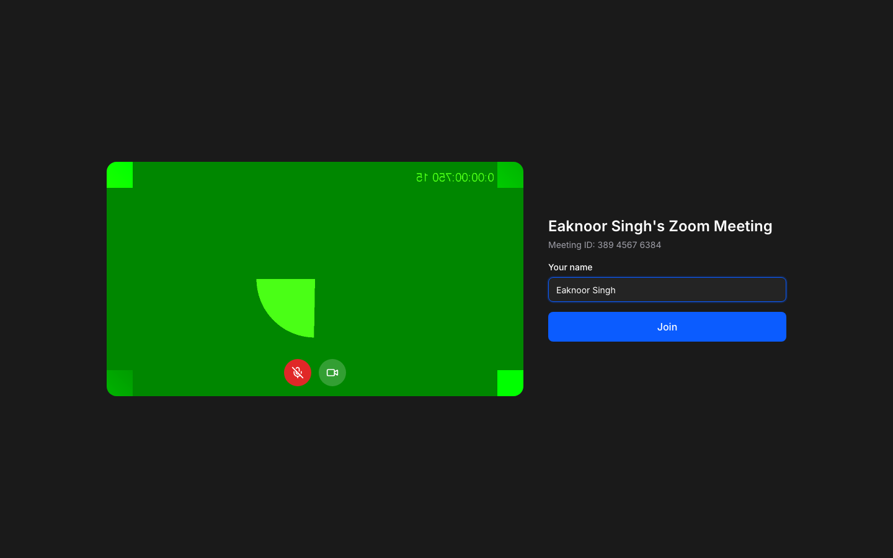
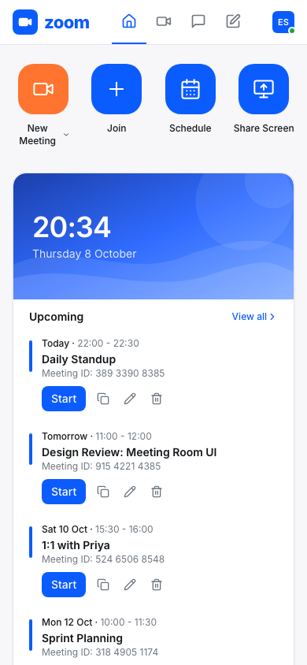
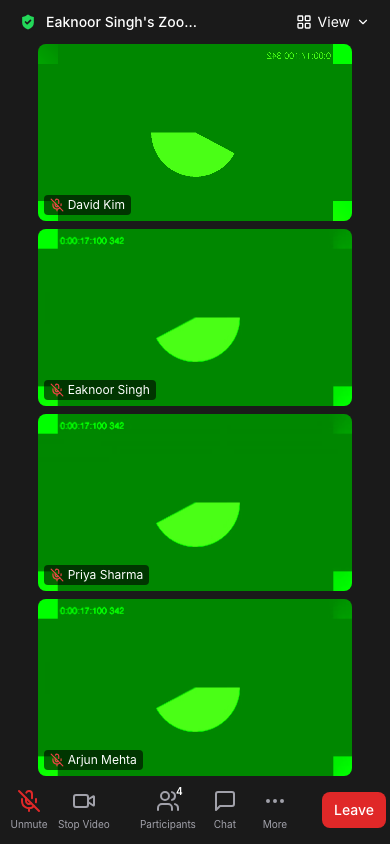

# Zoom Clone

A full-stack clone of the Zoom web app: start instant meetings, schedule meetings, join by meeting ID or invite link, and hold real-time audio/video calls in the browser with chat, reactions, screen sharing, a waiting room and host controls.

- **Frontend:** Next.js 14 (App Router, TypeScript), Tailwind CSS, lucide-react
- **Backend:** FastAPI, SQLAlchemy 2, Pydantic v2, SQLite
- **Realtime:** FastAPI WebSockets for signaling, WebRTC (peer-to-peer mesh) for media

## Screenshots

| Home | Schedule |
| --- | --- |
|  |  |
| **Meetings** | **Join** |
|  |  |
| **Meeting room: gallery + chat** | **Participants panel (host)** |
|  |  |
| **Invite dialog** | **Pre-join preview** |
|  |  |

| Mobile home | Mobile meeting |
| --- | --- |
|  |  |

> The green video in the screenshots is Chrome's built-in fake camera, used for automated testing.

## Features

- **Home dashboard:** New Meeting (with "Start with video" / "Use personal meeting ID" options), Join, Schedule and Share Screen tiles, a live clock banner, and Upcoming and Recent meetings with Start / Copy invitation / Edit / Delete.
- **Instant meetings:** one click creates a live meeting, opens the pre-join preview, then the room with the invite dialog (formatted ID `845 1236 7901`, passcode, link and copy buttons).
- **Join:** accepts a meeting ID *or* a pasted invite link (the passcode is taken from the link). Has "Don't connect to audio" and "Turn off my video" options, and shows inline errors for not found, ended, cancelled, missing passcode and wrong passcode.
- **Invite links:** `/j/{code}?pwd={passcode}` validates the link and asks only for a display name.
- **Scheduling:** topic, description, date, start time in 30-minute steps, duration, time zone (every IANA zone), auto-generated editable passcode, waiting room and mute-on-entry. The same form edits existing meetings.
- **Meetings page:** Upcoming / Previous / Personal Room tabs, grouped by date, with search from the navbar.
- **Meeting room:**
  - Gallery view that resizes to fit the participant count, and a Speaker view.
  - Active-speaker highlight from Web Audio volume detection.
  - Mute and video toggles, each with a device picker.
  - Screen sharing, which takes the main stage automatically.
  - Reactions, chat with history and unread badge, participants panel, and security info.
  - Keyboard shortcuts **Alt+A** (mute) and **Alt+V** (video).
- **Host controls:** mute all, mute one, remove (the removed user sees "You have been removed"), admit or remove people from the waiting room, end the meeting for everyone. Attendees can only leave.
- **Responsive:** on phones, tiles reflow and the control bar shows the key buttons plus "More".

## Architecture

```
 Browser (Next.js SPA)                                   FastAPI (uvicorn)
┌─────────────────────────────────────┐   REST /api   ┌───────────────────────────────┐
│ app/ routes → components            │ ────────────▶ │ routers/ (thin)               │
│ lib/api.ts (typed fetch client)     │ ◀──────────── │   └▶ services/ (business logic)│
│                                     │               │        └▶ SQLAlchemy ─▶ SQLite │
│ hooks/useMeeting  ─ MeetingSocket ──┼── WebSocket ─▶│ routers/ws.py                 │
│ hooks/useWebRTC   ─ PeerManager     │  (signaling,  │   └▶ ConnectionManager        │
│ hooks/useMediaDevices (camera/mic)  │   presence,   │      (rooms + waiting lobby,  │
└───────────────┬─────────────────────┘   chat, host  │       in-memory per process)  │
                │                          actions)    └───────────────────────────────┘
                │  WebRTC media (SRTP), peer-to-peer
                ▼  STUN: stun.l.google.com:19302
        other participants' browsers (full mesh)
```

**Media never passes through the server.** The backend only relays small JSON signaling messages. Each pair of participants has a direct `RTCPeerConnection`.

### How a call is set up

1. `POST /api/meetings/{code}/join` creates a `participant` row and returns its id and role.
2. The browser opens `WS /ws/meetings/{code}?participant_id=…`. The server replies with `welcome`, which contains everyone currently present plus the chat history, and broadcasts `participant-joined` to the others.
3. **The newcomer offers to everyone already in the room; existing participants only answer.** This rule means two peers never send offers to each other at the same time ("glare").
4. Every connection carries exactly two transceivers, audio then video. Mute, camera on/off, device switching and screen sharing all use `RTCRtpSender.replaceTrack()`, so the connection never needs renegotiating.
5. ICE candidates that arrive before the remote description are queued, then applied.
6. Mic and camera state changes are sent as `media-state`, saved, and broadcast so every tile shows the right icons.

### WebSocket message types

| Client → server | Server → client |
| --- | --- |
| `signal {to, data}` | `welcome`, `waiting`, `waiting-room` |
| `media-state {is_muted, is_video_on}` | `participant-joined / -left / -updated` |
| `screen-share {active}` | `signal {from, data}`, `screen-share` |
| `chat {content}` | `chat`, `reaction` |
| `reaction {emoji}` | `muted-by-host`, `removed`, `meeting-ended`, `error` |

Host actions go through REST endpoints, so they can be checked server-side. The REST handler then pushes the resulting event to the room over the sockets.

## Database schema

```
users 1 ──< meetings (host_id)
users 1 ──< participants (user_id, nullable for guests)
meetings 1 ──< participants      (ON DELETE CASCADE)
meetings 1 ──< chat_messages     (ON DELETE CASCADE)
participants 1 ──< chat_messages (ON DELETE CASCADE)
```

| Table | Columns |
| --- | --- |
| **users** | `id` PK, `name`, `email` UNIQUE, `avatar_color`, `personal_meeting_id` UNIQUE, `created_at` |
| **meetings** | `id` PK, `meeting_code` UNIQUE (10–11 digits), `title`, `description`, `host_id` FK→users, `type` (`instant`\|`scheduled`), `status` (`scheduled`\|`live`\|`ended`\|`cancelled`), `scheduled_start` (nullable for instant), `duration_minutes`, `timezone` (IANA), `passcode`, `invite_link`, `waiting_room_enabled`, `mute_on_entry`, `created_at`, `started_at`, `ended_at` |
| **participants** | `id` PK, `meeting_id` FK→meetings, `user_id` FK→users (nullable), `display_name`, `role` (`host`\|`co_host`\|`attendee`), `joined_at`, `left_at`, `is_muted`, `is_video_on`, `is_removed`, `is_admitted` |
| **chat_messages** | `id` PK, `meeting_id` FK→meetings, `participant_id` FK→participants, `content`, `sent_at` |

Design notes:

- **Indexes:** `meetings.meeting_code` (unique), `meetings.scheduled_start`, `participants.meeting_id`, `chat_messages.meeting_id`, plus a composite `(host_id, status)` for the dashboard queries.
- **Timestamps:** stored as UTC by a small `UTCDateTime` type, which always returns timezone-aware values, so the API emits `…Z` timestamps that browsers parse correctly. `meetings.timezone` keeps the zone the meeting was scheduled in, so edits can show the original wall-clock time.
- **Enums** are stored as strings, which keeps them portable and readable.
- **SQLite foreign keys** are switched on with `PRAGMA foreign_keys=ON` so the cascades actually run.
- **Participants are kept, not deleted.** Each row records when someone joined, when they left, and whether they were removed. The Recent list counts attendees from these rows.
- `participants.is_admitted` is the one column added beyond the original spec. It is `false` while someone is in the waiting room.
- **Meeting IDs** are random 11-digit codes (Personal Meeting IDs use 10 digits) that never start with 0. They are checked against both `meetings` and `users.personal_meeting_id` and regenerated on a collision. Passcodes are 6 random letters/digits from `secrets`.

## API

All errors use one shape: `{"error": {"code": "meeting_not_found", "message": "…"}}`.

| Method | Path | Description |
| --- | --- | --- |
| GET | `/api/health` | Health check |
| GET | `/api/users/me` | Default signed-in user |
| POST | `/api/meetings/instant` | `{use_personal_meeting_id?}` → live meeting with code, passcode, invite link |
| POST | `/api/meetings/schedule` | `{title, description, date, time, duration_minutes, timezone, passcode?, waiting_room_enabled, mute_on_entry}`; start must be in the future |
| GET | `/api/meetings/upcoming` | Scheduled/live meetings hosted by the user that haven't finished |
| GET | `/api/meetings/recent` | Ended meetings the user hosted or attended |
| GET | `/api/meetings/{code}` | Meeting details (404 if missing) |
| POST | `/api/meetings/{code}/validate` | `{passcode?}` → `{ok: true, meeting}` or `{ok: false, error: {code, message}}`. Codes: `meeting_not_found`, `meeting_ended`, `meeting_cancelled`, `passcode_required`, `invalid_passcode` |
| PATCH | `/api/meetings/{code}` | Edit an upcoming scheduled meeting (owner only) |
| DELETE | `/api/meetings/{code}` | Cancel a meeting (soft delete → `cancelled`) |
| POST | `/api/meetings/{code}/join` | `{display_name, passcode?, user_id?, is_video_on}` → participant (+ role) and meeting |
| GET | `/api/meetings/{code}/participants` | Participants currently connected |
| POST | `/api/meetings/{code}/end` | Host only: end for everyone |
| POST | `/api/meetings/{code}/mute-all` | Host only |
| POST | `/api/meetings/{code}/participants/{id}/mute` | Host only |
| POST | `/api/meetings/{code}/participants/{id}/remove` | Host only |
| POST | `/api/meetings/{code}/participants/{id}/admit` | Host only: admit from the waiting room |
| WS | `/ws/meetings/{code}?participant_id=` | Signaling, presence, chat, reactions, host events |

Host-only endpoints take `{"participant_id": <caller>}` in the body. The server checks that this participant belongs to the meeting and is the host or a co-host. Interactive API docs are served at `http://localhost:8000/docs`.

## Project structure

```
backend/app/
  main.py              FastAPI app, CORS, routers, create + seed on startup
  config.py            env vars
  database.py          engine, SessionLocal, Base, UTCDateTime, get_db dependency
  models.py / schemas.py
  errors.py            AppError + uniform error handlers
  routers/             meetings, participants, users, ws   (thin)
  services/            meeting_service (IDs, passcodes, scheduling, validation)
                       participant_service, realtime_service (WS protocol)
                       connection_manager (sockets per room + waiting lobby)
  seed.py
frontend/
  app/                 /, /join, /schedule, /meetings, /meeting/[meetingId], /j/[meetingId]
  components/          layout/, dashboard/, join/, schedule/, meetings/, meeting/, ui/
  hooks/               useMeeting, useWebRTC, useMediaDevices, useActiveSpeaker, …
  lib/                 api.ts, webrtc.ts (PeerManager), signaling.ts, utils.ts, schedule.ts
  types/               index.ts (mirrors Pydantic schemas), realtime.ts (WS protocol)
```

## Local setup

**Prerequisites:** Python 3.9+ (3.11 recommended), Node.js 18.18+ (20 LTS recommended).

```bash
# Backend: http://localhost:8000
cd backend
python3 -m venv .venv
source .venv/bin/activate
pip install -r requirements.txt
cp .env.example .env
uvicorn app.main:app --reload --port 8000
```

On first start the backend creates `backend/zoom.db` and seeds demo data. To reset it:

```bash
python -m app.seed --reset
```

```bash
# Frontend: http://localhost:3000
cd frontend
npm install
cp .env.example .env.local
npm run dev
```

To try a call, click **New Meeting**, copy the invite link, and open it in a second browser window or an incognito window. Each tab keeps its own join session, so the second tab joins as a guest.

### Environment variables

| Variable | Where | Default | Purpose |
| --- | --- | --- | --- |
| `NEXT_PUBLIC_API_URL` | frontend | `http://localhost:8000` | REST base URL |
| `NEXT_PUBLIC_WS_URL` | frontend | derived from API URL | WebSocket base (`wss://…` in production) |
| `DATABASE_URL` | backend | `sqlite:///backend/zoom.db` | SQLAlchemy URL |
| `FRONTEND_URL` | backend | `http://localhost:3000` | Used in invite links and CORS |
| `CORS_ORIGINS` | backend | – | Extra allowed origins (comma-separated) |
| `CORS_ORIGIN_REGEX` | backend | – | e.g. `https://zoom-clone-.*\.vercel\.app` for preview deployments |
| `EMPTY_MEETING_GRACE_SECONDS` | backend | `60` | How long an empty live meeting stays open before it is ended |

### Quality checks

```bash
cd frontend
npm run typecheck
npm run lint
npm run format
npm run build
```

The flows were tested end to end in two headless Chrome instances using Chrome's fake camera:

- two-way video, chat and unread badge, reactions
- Alt+V propagating to the other peer
- mute all, remove, and end for all
- waiting room admit and mute-on-entry
- join by link, wrong or unknown passcode errors, edit, and delete

## Deployment

### Backend on Render

1. Create a **Blueprint** from this repo; it uses `render.yaml`. Or create a Web Service by hand with:
   - root directory: `backend`
   - build command: `pip install -r requirements.txt`
   - start command: `uvicorn app.main:app --host 0.0.0.0 --port $PORT`
2. Set `FRONTEND_URL` to your Vercel URL. Optionally set `CORS_ORIGIN_REGEX` for preview URLs.
3. **SQLite on free hosting is ephemeral.** The disk is wiped on every deploy or restart, and the seed runs again automatically on boot. To keep data, attach a persistent disk and point `DATABASE_URL` at it (e.g. `sqlite:////var/data/zoom.db`), or use Postgres.
4. Run a single instance. WebSocket rooms live in process memory (see Future improvements).

A `Procfile` is included for Railway or Heroku-style hosts.

### Frontend on Vercel

1. Import the repo and set **Root Directory** to `frontend`.
2. Set the environment variables:
   - `NEXT_PUBLIC_API_URL=https://<your-api>.onrender.com`
   - `NEXT_PUBLIC_WS_URL=wss://<your-api>.onrender.com`
3. Deploy, then update `FRONTEND_URL` on the backend so invite links point at Vercel.

Camera and microphone access needs HTTPS, which both platforms provide.

## Assumptions

- **No authentication.** Every request acts as the seeded default user, Eaknoor Singh (`id = 1`). A tab that *starts* a meeting joins as host (it sends `user_id`). A tab that *joins* by ID or link is a guest. This is decided per browser tab with `sessionStorage`.
- **Mesh WebRTC** connects every participant to every other one, so upload cost grows with each person. It works well for small meetings, around 2–6 people.
- **STUN only, no TURN.** Peers behind strict or symmetric NATs, or some corporate firewalls, may fail to connect.
- **Attendees can join a scheduled meeting before the host.** The first join switches its status to `live`.
- **Empty meetings auto-end** after a 60 s grace period, so a page refresh doesn't end a call.
- **Removed participants** can't reconnect with the same participant id. Without accounts, they could still rejoin under a new name.
- **Recording, Team Chat, Whiteboards and Settings** are placeholders.

## Future improvements

- Real authentication (OAuth/JWT) and per-user dashboards.
- TURN server (e.g. coturn) for NAT traversal, and an SFU (LiveKit, mediasoup) for larger meetings.
- Redis pub/sub for the connection manager so the API can scale horizontally.
- Postgres with Alembic migrations.
- Recurring meetings and calendar (ICS) invites.
- Recording, breakout rooms, raise hand, virtual backgrounds, and co-host assignment and host transfer.
- Automated test suites (pytest for services and routers, Playwright for the flows above) in CI.
